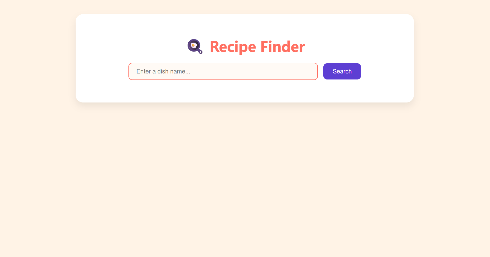

# 🍳 Recipe Finder App

A simple and beautiful **Recipe Finder** app built using **HTML**, **CSS**, and **JavaScript**.  
Search your favorite meals and get their ingredients, instructions, and image — all powered by [TheMealDB API](https://www.themealdb.com/api.php).

---

## 🔍 Features

- Search recipes by dish name
- Fetch and display:
  - Recipe image
  - Ingredients list
  - Cooking instructions
- Clean and colorful UI
- Responsive layout

---

## 🚀 Demo

---

## 🛠️ Tech Stack

- HTML5
- CSS3
- JavaScript (ES6)
- [TheMealDB API](https://www.themealdb.com/api.php)

---

## 📸 Preview

---

